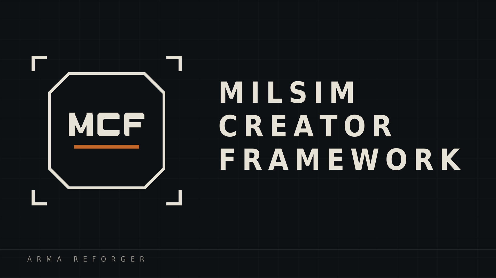

  

<h1 align="center">Milsim Creator Framework</h1>

  A mission framework for Arma Reforger, for co-op groups who author a story
  live in Game Master instead of scripting one beforehand.

  <a href="https://github.com/olmopje/milsim-creator-framework/wiki"><b>Documentation</b></a> ·
  <a href="https://github.com/olmopje/milsim-creator-framework/wiki/Getting-Started">Getting started</a> ·
  <a href="https://github.com/olmopje/milsim-creator-framework/issues">Report a bug</a>

---

## What it is

Intel is a thing you carry, not a notification.

Letters, notepads, phones and laptops lie in the world. A player picks one up,
reads it, walks it back to the operations board and logs it. A commander turns
that into an order in five-paragraph format, gives it a place on the map, and
puts it on the board. Somebody accepts it, writes back in their own words what
they intend to do, and the commander closes it when the job is done.

That is the whole idea: what a unit knows, and what it has been told to do,
become things that exist in the world — things that can be found, carried,
handed over and lost.

No dependency on Scenario Framework, Ci5 or GME. Informed by them, built
separately.

## Getting it

**On the Arma Reforger Workshop.** Search for *Milsim Creator Framework* —
there are two entries and you need both.

| Module | What it gives you |
|---|---|
| **Core** | Storage that survives a restart, interactive screens on world objects, the event layer. No gameplay of its own; Intelligence needs it. |
| **Intelligence** | Intel you can pick up and carry, the operations board, a map board, and the Game Master tools to author and manage all of it. |

Load both. Nothing has to be placed in your world to switch them on — each
attaches itself to whatever game mode your mission uses, vanilla or modded.

The [wiki](https://github.com/olmopje/milsim-creator-framework/wiki) is the
manual. [Your First Mission](https://github.com/olmopje/milsim-creator-framework/wiki/Your-First-Mission)
walks from an empty world to something playable in one sitting.

## Coming later

Two more modules are built and running, held back until they have had the same
testing:

- **Objectives** — placeable trigger and logic nodes: proximity, cone and line
  of sight detection, AND/OR/counter logic, relays, recipes, objectives.
- **AI** — shout, surrender, restrain and escort. Civilian behaviour, patrol
  points, ambient actors. Conversations with any character in the game, gated
  on trust and fear.

## The state of it

Early, and honest about it. Everything the wiki describes as working has been
watched running in a live session with connected players, not merely compiled —
which is a real distinction in Enfusion, where a replication fault compiles
perfectly and only fails once a second player is there.

An automated test suite runs inside a live session with two players on two
factions. It currently passes 16 of 17 checks; the one that fails is a device
profile not reaching the second client within 16 seconds, which is a streaming
problem rather than a logic one.

Still open, said plainly:

- **A commander cannot push an order at somebody.** Accepting a job is still
  the only route from published to assigned. A group leader accepting for his
  whole group is as close as it gets.
- **Late join has not been tested.** A client arriving into a mission that
  already has authored intel should work, and has never been watched.
- **Role restrictions resolve correctly but have never refused anything.**
- **Dropped intel objects do not respawn after a restart.** The board record
  survives; the physical document does not.

Expect rough edges, and expect things to change between versions.

## Reporting something

Bugs and requests go in the
[issue tracker](https://github.com/olmopje/milsim-creator-framework/issues).

Tell us what you did, what happened and what you expected. If you can, attach
the `[MCF]` lines from your log — every part of the framework writes one when it
starts and another when it does something, and those lines are usually the
whole answer.

## License

Arma Public License (APL). See [LICENSE.md](LICENSE.md).
